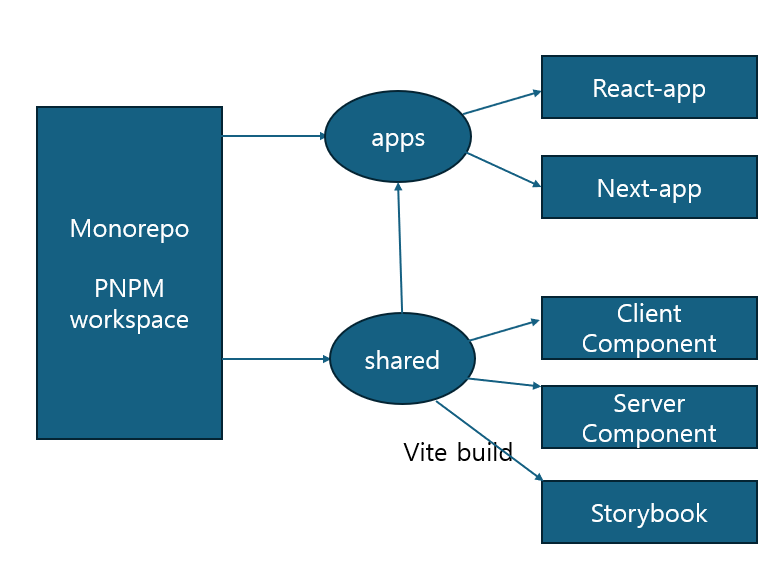

# Monorepo by pnpm

## 배경

프로젝트를 시작할 때마다 유사한 형태의 컴포넌트를 반복적으로 개발하는 비효율을 줄이고, 디자인 가이드에 기반한 일관된 컴포넌트를 재사용하기 위해 모노레포를 도입하였습니다.
디자인 가이드는 [Material Design 3](https://m3.material.io/components)을 참고하였습니다.

## 🛠️ 사용기술

- pnpm
- vite
- storybook

## 🏗️ 아키텍쳐



- **apps/** – 배포용 프로젝트
- **pnpm-workspace.yaml** – `pnpm` 워크스페이스 설정 파일 (`apps/`, `packages/` 경로 포함)
- **tsconfig.base.json** – 각 프로젝트에서 공통으로 사용하는 TypeScript 설정
- **packages/shared/** – 재사용 가능한 컴포넌트, Material Design 3 기반 UI 컴포넌트 제공

> **공유 컴포넌트 구조 및 빌드 방식**

- `vite`를 사용해 빌드하며, `build.lib.entry` 옵션을 통해 `client`, `server`로 분리된 엔트리 파일로 빌드합니다.
- Next.js의 Client/Server 컴포넌트 구조를 고려하여 컴포넌트를 나눴습니다.
- `rollupOptions`를 통해 `react`, `react-dom`, `storybook` 관련 파일은 외부 의존성으로 처리되어 번들링에서 제외됩니다.
- Storybook은 개발 및 문서화를 위한 용도로 `shared` 패키지에서 개별적으로 빌드/실행됩니다.

## 🛠️ Why PNPM

### 1. pnpm의 빠른 속도, 효율적인 방식의 패키지 관리

pnpm은 `package.json`에 명시된 패키지를 읽은 후 `node_moduels`에 symbolic Link(symlink)을 생성하여 전역 저장소의 해당 패키지를 참조하여 disk 낭비를 줄입니다.

### 2. 간단한 모노레포 설정

pnpm-workspace는 간단하게 모노레포 설정을 할 수 있습니다. `pnpm-workspcae.yaml` 파일에 모노레포를 적용할 폴더를 명시하고 `package.json`에 간단한 설정을 해 주면 끝입니다. 만들어진 패키지들은 자동으로 링크되기에 별도로 설치나 연결해줄 필요가 없습니다.

---

## ✨ 기술 구현 상세

### 1. Vite 설정을 통한 개발 생산성 향상

- `vanillaExtractPlugin` 추가: shared 컴포넌트는 `vanilla-extract/css`를 사용해 스타일링.
- `resolve.alias`를 활용하여 컴포넌트 import 경로를 간결하게 지정.
- `tsconfig.base.json`을 공통으로 두어 타입 설정 일관성 유지.
- `references` 설정을 통해 각 프로젝트 간 의존성 명시 및 빌드 순서 보장.

```
import { vanillaExtractPlugin } from "@vanilla-extract/vite-plugin";

// https://vite.dev/config/
export default defineConfig({
  plugins: [react(), tailwindcss(), vanillaExtractPlugin()],
  resolve: {
    alias: {
      "@monorepo-pnpm/shared": path.resolve(
        __dirname,
        "../../packages/shared/src/index.ts"
      ),
    },
  },
});

// tsconfig.json
{
  "extends": "../../tsconfig.base.json",
  "compilerOptions": {
    "noEmit": true
  },
  "include": ["src"],
  "references": [{ "path": "../../packages/shared" }]
}
```

### 2. Server/Client 빌드 분리 및 불필요한 번들 제외

> Next.js의 Server/Client Component 구조 대응

- shared 내 컴포넌트를 client, server로 구분하여 Vite에서 별도로 빌드
- rollupOptions.external을 설정해 React, Storybook, 테스트 파일 등 불필요한 번들 제외
- package.json의 exports 필드로 명시적 경로 지정

```tsx
// shared/vite.config.ts
  build: {
    lib: {
      entry: {
        client: "src/client/index.ts",
        server: "src/server/index.ts",
      },
      formats: ["es"],
    },
  },
  rollupOptions: {
    ...
    external: [
      "react",
      "react-dom",
      path.resolve(__dirname, "src/test/**"),
      /\.stories\.(ts|tsx)$/,
      /\.mdx$/,
    ],
  },

// shared/package.json
  "exports": {
    "./server": {
      "import": "./dist/server.mjs",
      "types": "./build/server/index.d.ts"
    },
    "./client": {
      "import": "./dist/client.mjs",
      "types": "./build/client/index.d.ts"
    },
    "./shared.css": {
      "import": "./dist/shared.css"
    }
  },
```

### 3. Storybook을 통한 컴포넌트 문서화 및 UI 테스트

- `*.stories.tsx`를 작성해 각 컴포넌트 테스트
- `.mdx` 파일을 통해 컴포넌트 문서화

### 4. vanilla-extract 기반 스타일 시스템

> Zero-runtime, 타입 안전 스타일링 시스템 구축

- `vanilla-extract/css`: 런타임 없는 CSS-in-TypeScript
- `recipes`: variant 기반 스타일 구성, 자동완성 지원
- `sprinkles`: 속성별 제약으로 안정성 확보
- `createTheme`, `createThemeContract`로 테마 동적 구성
- `Material Design 3`의 Design Token 기반 구조 설계

```tsx
//Material Design 3 Appbar 스타일 예시
export const md3Appbar = recipe({
  base: [
    sprinkles({
      backgroundColor: "surface",
      boxShadow: "level0",
      px: 4,
      borderRadius: "none",
      display: "flex",
    }),
    {
      boxSizing: "border-box",
    },
  ],
  variants: {
    size: {
      sm: [{ alignItems: "center", height: 64, gap: 4 }],
      md: [
        {
          flexDirection: "column",
          height: 112,
          justifyContent: "space-between",
          paddingTop: "1rem",
        },
      ],
      lg: [
        {
          flexDirection: "column",
          // Originally 152px
          height: 132,
          justifyContent: "space-between",
          paddingTop: "1rem",
        },
      ],
    },
  },
});
```

```tsx
// shared/src/styles/theme.css.ts
export const themeContract = createThemeContract({ colors });

// 프로젝트별 테마 적용(themeContract: shared 프로젝트에서 import)
export const lightThemeClasses = createTheme(themeContract, {
  colors: lightColors,
});
```

### 5. Compound Pattern으로 재사용성과 유연성 확보

> Headless 컴포넌트 + Compound Pattern

- 내부 구현은 감추고 유연한 조합만 노출
- 복잡한 입력 필드를 TextField 하위 컴포넌트로 분리

```tsx
// Md3TextField 사용시
<Input
  label="이메일"
  clear={<button>Clear</button>}
/>

// 내부 구조 예
<TextField>
  <TextField.FloatingLabel>{label}</TextField.FloatingLabel>
  <TextField.Clear as={clear} />
<TextField/>
```
