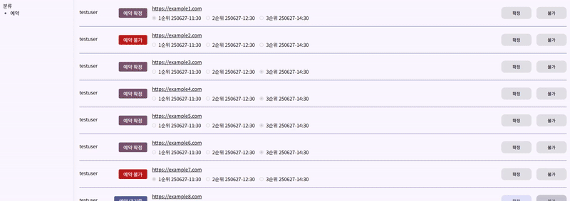

## 일본 음식점 예약 플랫폼

기존 [일본 음식점 예약 플랫폼](https://github.com/hansolc/omatasae-japan-restaurant-reservation-service)의 서버가 종료됨에 따라, **Next.js App Router와 API Routes**를 활용해 **Serverless 환경**으로 리팩토링한 프로젝트입니다.  
디자인 시스템은 모노레포 기반의 shared 컴포넌트를 활용해 개발 효율성과 UI 일관성을 높였습니다.

🔗 배포 주소: [Omatasae바로가기](https://monorepo-pnpm-omatasae-next.vercel.app/)

## 🏁 프로젝트 배경

최근, 일본여행을 많이 가는 사람들을 대상으로 일본에 음식점을 미리 예약하고 싶은 경우 일본서비스를 사용 하거나 지인 혹은 인터넷에서 일본어 가능자를 통해 3000원 정도에 음식점을 대리 예약 합니다.

따라서, 한국 웹 서비스를 통해 음식점 링크와 예약 희망 날짜를 접수 받고 직접 일본에 예약을 한 후 전달하는 중개 서비스 입니다.

일본에 여행을 하기 전 음식점 예약을 원하는 분들을 타겟으로 합니다.

## 🛠️ 사용기술

- **Frontend**: Next.js (v14 App Router), Tailwind CSS
- **State Management**: Recoil, TanStack Query
- **Database**: MongoDB Atlas + Mongoose
- **컴포넌트**: `@monorepo-pnpm/shared` (Material Design 3 기반 UI 시스템)
- **패키지 관리**: pnpm (Monorepo)

## 🔍 주요 기능

### ✅ 사용자

<div style="display: flex; align-items: flex-start; gap: 1rem;">
  <ul>
    <li>로그인/회원가입 후 음식점 예약 요청 가능</li>
    <li>예약 생성/삭제 및 상태 확인 가능</li>
    <li>1~3순위까지 날짜/시간 선택 가능</li>
  </ul>
  
</div>

### ✅ 관리자

- 모든 예약 정보 조회
- 예약 요청을 **확정** 또는 **거절** 처리

  

## ✨ 기술 구현 상세

### 1. 로그인 상태 유지 - Recoil & 쿠키 기반

- [Home Header](<https://github.com/hansolc/monorepo-pnpm/blob/main/apps/omatasae-next/src/app/(user)/components/header/HomeHeader.client.tsx>) 컴포넌트는 로그인 상태에 따라 헤더 UI가 다르게 렌더링됨
- `layout.tsx`에서 JWT 토큰을 해석하여 Recoil로 로그인 상태를 유지

```tsx
export default function RootLayout({
  children,
}: Readonly<{
  children: React.ReactNode;
}>) {
  const user = decodeUserJwt();     // JWT 토큰 해석
  return (
    <html lang="en">
      <ReactQueryProvider>
        <RecoilRootWrapper user={user}>
          <body
            className={clsx(lightThemeClasses, noto.className, "bg-background")}
          >
            {children}
          </body>
        </RecoilRootWrapper>
```

### 2. 예약 입력 검증 - ([useFormValidation.ts](https://github.com/hansolc/monorepo-pnpm/blob/main/apps/omatasae-next/src/hooks/useFormValidation.ts))

- [ReservationForm 컴포넌트](https://github.com/hansolc/monorepo-pnpm/blob/main/apps/omatasae-next/src/components/ReservationForm/index.tsx) 예약 입력 폼은 shared 패키지의 MD3 `TextField`를 사용
- 최대 3개의 날짜/시간을 등록할 수 있도록 구현
- 성능 최적화를 위해 Uncontrolled 방식으로 구현:
  - `useFormValidation` 훅을 통해 각 필드의 `register`, `errors`, `handleSubmit` 관리
  - 필수 여부 및 정규식 패턴 검증
  - 등록한 규칙이 모두 통과 해야만 handleSubmit에 콜백 함수로 등록한 API 호출

```tsx
const { handleSubmit, register, errors } =
  useFormValidation<ReservationInfoType>(); // 훅 호출

<Md3TextField
  label={`YYMMDD`}
  type="text"
  outlined
  {...register(date, {
    required: date === "primaryDate", // 필수입력
    pattern: {
      // 정규식 등록, 틀릴경우 message 출력
      value: /^\d{2}(0[1-9]|1[0-2])(0[1-9]|[12][0-9]|3[01])$/,
      message: "YYMMDD 형식으로 작성해주세요.",
    },
  })}
  error={errors[date]}
  inputConfig={{
    leadingIcon: <MdOutlineDateRange size="24" />,
    supportingText: "ex) 250624",
  }}
/>;
```

### 3. 로그인 전 예약 제출 UX 개선

- 로그인하지 않은 상태에서 예약 시도 시 `localStorage`에 예약 정보를 임시 저장
- 로그인 후 해당 정보를 불러와 자동으로 예약 처리
- [useCreateReservation.tsx](https://github.com/hansolc/monorepo-pnpm/blob/main/apps/omatasae-next/src/hooks/reservations/useCreateReservation.ts)

```tsx
// useCreateReservation

// 로그인 하지 않고 예약 시도시 해당 함수 호출
const createReservation = (info: ReservationInfoType) => {
  if (!user) {
    if (window.confirm("예약 생성을 위해 로그인이 필요합니다.")) {
      localStorage.setItem("pendingReservation", JSON.stringify(info));
      router.push("/login");
    }
    return;
  }
  mutation.mutate(info);
};

// useLogin.tsx 훅에서 로그인 성공 시 tryReservationAfterLogin() 함수 호출
onSuccess: (res) => {
  setUser(res);
  tryReservationAfterLogin();
  if (role === "user") {
    router.push("/");
  } else if (role === "admin") {
    router.push("/admin");
  }
},
```

### 4. 관리자 페이지 - 무한 스크롤([useInfiniteScroll.ts](https://github.com/hansolc/monorepo-pnpm/blob/main/apps/omatasae-next/src/hooks/useInfiniteScroll.ts))

- 예약 목록을 효율적으로 페이지네이션 처리하며 불필요한 로딩 방지
- `useInfiniteQuery` + `IntersectionObserver` 조합으로 무한 스크롤 구현([ReservationContent.tsx](https://github.com/hansolc/monorepo-pnpm/blob/main/apps/omatasae-next/src/app/admin/components/ReservationContent/index.tsx))

  - 페이지네이션 정보: skip, limit
  - initialData: 초기 데이터
  - apiCall: API 함수

  ```tsx
  const { data, fetchNextPage, hasNextPage, isFetchingNextPage } =
    useInfiniteScroll({
      apiCall: getReservation,
      initialData: initialData,
      key: "reservations",
      limit: 10,
      skip: 0,
    });
  const { observe } = useObserve({ observedCallback: fetchNextPage });

  useEffect(() => {
    if (ref.current) {
      observe(ref.current); // observe 등록
    }
  }, [observe]);

  return (
    <Section padding className="flex flex-col py-2 gap-4">
      <Section.Title>예약 내역</Section.Title>
      <ReservationList data={data} />
      {hasNextPage && <div ref={ref}></div>} // 가장 아래 감지 노드 배치
      {isFetchingNextPage && <div>가져오는중...</div>} // Loader
    </Section>
  );
  ```

### 5. SEO 및 성능 최적화 - Next.js

- 페이지별 `metadata` 등록으로 SEO 개선
- 로그인/회원가입/관리자 페이지 등은 `robots` 설정으로 검색 제외
- 서버/클라이언트 컴포넌트 분리로 Hydration 비용 최소화

```tsx
// (user)/page.tsx
export const metadata: Metadata = {
  title: "Omatasae | 일본 식당 예약 플랫폼",
  description:
    "일본 음식점의 구글 지도 링크와 예약 정보를 입력하면, 대신 예약을 도와드리는 플랫폼입니다.",
  keywords: ["일본 식당", "식당 예약", "일본 여행", "구글 링크", "Omatasae"],
  openGraph: {
    ...
    ...
  },
};

//(user)/login/page.tsx
export const metadata: Metadata = {
  title: "로그인 | Omatasae",
  robots: {
    index: false,
    follow: false,
  },
};
```

```tsx
// HomeHeader.server
function HomeHeader({ actions }: { actions: React.ReactNode }) {
  return <Appbar headline="오마타세" size="sm" trailingIcon={[actions]} />;
}

// HomeHeader.client
export default function HeaderActions() {
  const user = useRecoilValue(userState);
  const { logout } = useLogout();

  if (user) {
    return (
      <>
        <Link href="/reservations" key="omatasae-reservations-verify">
          예약확인
        </Link>
        ...
        ...
  }
}
```

### 6. 사용자 예약 페이지 최적화

- `invalidateQueries`를 활용해 예약 생성/삭제 시 데이터 최신화
- `staleTime`과 `enabled`로 불필요한 호출 방지

```tsx
// userQueryReservations.ts
export default function useQueryReservation({ userId }: { userId?: string }) {
  const user = useRecoilValue(userState);
  return useQuery({
    queryKey: ["reservations"],     // reservations로 키 등록
    queryFn: () => getReservation({ userId }),
    enabled: !!user,                // 로그인 되지 않았을 경우 api 호출 하지 않음
    staleTime: 1000 * 60 * 5,       // staletime 5분
  });
}

// useCreateReservation.ts
function useCreateReservation() {
  const user = useRecoilValue(userState);
  const router = useRouter();
  const queryClient = useQueryClient();

  const mutation = useMutation({
    mutationFn: (info: ReservationInfoType) => create(info),
    onSuccess: () => {
      localStorage.removeItem("pendingReservation");
      // 예약 생성 성공시 업데이트
      queryClient.invalidateQueries({ queryKey: ["reservations"] });
      ...
      ...
```

## 🧩 추가 구현 사항

- `middleware.ts`: 로그인한 사용자가 `/login`, `/signup` 접근 시 자동 리다이렉트
- `not-found.tsx`: 잘못된 경로 진입 시 이전 페이지로 이동 처리
- `/admin`: TailwindCSS를 활용한 반응형 레이아웃 구성
- 시맨틱 태그 사용: `main`, `section`, `aside` 등으로 웹 접근성 개선
- 각 페이지는 해당 역할을 분명히 알 수 있도록 컴포넌트 구조 설계
- `mongoose` 기반 DB 모델 정의 및 API Routes 활용한 Serverless 환경 구성

## 🚫 고려하지 않은 부분

- 현재 API에는 별도의 인증/권한 관리가 적용되어 있지 않습니다.
  - 예: 사용자와 관리자의 API 접근을 구분하지 않음

## 📝 향후 개선 사항

- 날짜 및 시간 입력 UX 개선
  - 현재 `YYMMDD`, `HH:mm` 문자열 입력 방식은 사용성이 떨어짐
  - 보다 직관적인 Date Picker, Time Picker 등으로 개선 예정
